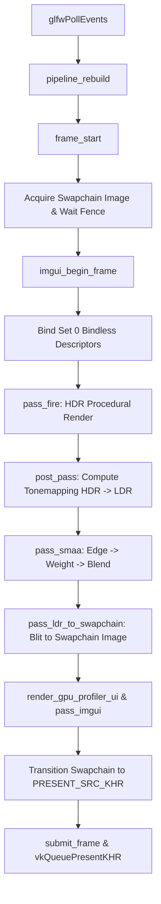

# Vulkan Renderer Design & Architecture Reference

This document provides a comprehensive architectural breakdown of the Vulkan rendering engine. It is designed to quickly familiarize new developers and AI assistants with the design principles, codebase structure, memory layout, frame flow, bindless resource model, shader hot-reloading system, and extension patterns.

---

## 1. System Overview & Technology Stack

The renderer is a modern, lightweight, high-performance Vulkan 1.3 rendering engine written in C99 / C++17.

### Core Libraries & Dependencies
* **Dynamic Vulkan Loading**: `volk` (`volk.h`) for zero-overhead dynamic Vulkan function dispatch.
* **Memory Management**: Vulkan Memory Allocator (`VmaAllocator` / `vk_mem_alloc.h`) for GPU buffer and image allocations.
* **Math Library**: `cglm` (`cglm.h`) for vector and matrix operations (with `CGLM_ALL_UNALIGNED`).
* **UI & Debugging**: `cimgui` (C bindings for Dear ImGui) integrated via Vulkan dynamic rendering.
* **Shader Compiler**: Slang (`slangc`) compiled to SPIR-V via `compileslang.sh`.
* **Hot Reloading**: `dmon` (`dmon.h`) for OS-level file system watching of `shaders/` and `compiledshaders/`.
* **Profiling**: CPU profiling via `Tracy` (`TracyC.h`) and `mu_perf` micro-timers; GPU profiling via custom query pools (`GpuProfiler`).
* **ID Allocation & Pool Management**: `mu_id_pool` and `offset_allocator` (`mu.h`, `offset_allocator.h`).

---

## 2. Core Architectural Principles

### 1. Dynamic Rendering (No Render Passes / Framebuffers)
The renderer exclusively uses Vulkan 1.3 **Dynamic Rendering** (`vkCmdBeginRendering` / `vkCmdEndRendering`). Legacy `VkRenderPass` and `VkFramebuffer` objects are **not** used anywhere in this engine.

### 2. Fully Bindless Descriptor Model
* **Single Global Descriptor Set**: All textures, samplers, and storage images are bound once per frame at Set 0:
  * **Binding 0**: `VK_DESCRIPTOR_TYPE_SAMPLED_IMAGE` (`MAX_BINDLESS_TEXTURES = 65536`)
  * **Binding 1**: `VK_DESCRIPTOR_TYPE_SAMPLER` (`MAX_BINDLESS_SAMPLERS = 256`)
  * **Binding 2**: `VK_DESCRIPTOR_TYPE_STORAGE_IMAGE` (`16384`)
* **No Per-Draw Descriptor Binds**: Draw calls do not rebind descriptor sets. Shaders select resources dynamically using uint32 IDs passed via **Push Constants** or **Uniform Buffers**.

### 3. Fixed 256-Byte Push Constant Layout
All push constants across vertex, fragment, and compute shaders use a uniform 256-byte memory footprint defined via the `PUSH_CONSTANT` macro in `common.h`. This guarantees pipeline layout compatibility across all engine pipelines.

```c
PUSH_CONSTANT(MyPassPush,
    uint32_t src_texture_id;
    uint32_t output_image_id;
    uint32_t sampler_id;
    float    param;
);
```

### 4. Synchronization2 & Explicit Barrier Batching
State tracking (`ImageState`) tracks layout, stage, access flags, and queue family per image/mip. Barriers are queued into a `BarrierBatch` and flushed in batch (`flush_barriers()`) before pipeline execution to minimize synchronization overhead.

---

## 3. Directory & File Organization

```
.
├── main.c                 # Primary renderer implementation, engine state, frame loop, passes
├── common.h               # Core definitions, macros (PUSH_CONSTANT, VK_CHECK), includes
├── compileslang.sh        # Bash script invoking slangc for shader compilation
├── Makefile               # Build system supporting debug, release, and ASAN target
├── docs/
│   ├── rendererdesign.md  # Architecture specification (this file)
│   ├── texture.md         # Texture subsystem design & async upload specification
│   └── convention.md      # General conventions (Vulkan coordinate system)
├── shaders/               # Source Slang shaders (.slang)
│   ├── fire.slang         # Procedural graphics pass
│   ├── postprocess.slang  # Tone mapping & post-processing compute pass
│   ├── smaa_edge.slang    # SMAA Edge Detection pass
│   ├── smaa_weight.slang  # SMAA Blending Weight Calculation pass
│   ├── smaa_blend.slang   # SMAA Neighborhood Blending pass
│   └── tonemapping.slang  # Color space conversion utilities
├── compiledshaders/       # Auto-generated SPIR-V output (.spv)
└── src/
    ├── constant.h         # System constants (max limits, array bounds)
    ├── helpers.h          # Vulkan object creation helpers & GpuProfiler implementation
    └── slangtypes.h       # Shared CPU/GPU type definitions (GlobalData, vectors, matrices)
```

---

## 4. Primary Data Structures & Engine State

The primary engine state lives inside the global heap-allocated `Renderer` struct (`g_renderer`):

```c
typedef struct {
    // Timings
    double cpu_frame_ns, cpu_active_ns, cpu_wait_ns, cpu_wait_accum_ns;
    uint32_t current_frame; // 0..MAX_FRAMES_IN_FLIGHT - 1
    float dt;

    // Per-frame contexts
    FrameContext frames[MAX_FRAMES_IN_FLIGHT];

    // Swapchain & Device
    FlowSwapchain swapchain;
    InstanceContext instance;
    DeviceContext devc;
    GLFWwindow *window;
    DeviceInfo info;

    // Subsystems
    TextureSystem texture_system;
    Bindless bindless_system;
    DefaultSamplerTable default_samplers;
    RendererPipelines render_pipelines;

    // Render Targets (triple-buffered per swapchain image)
    RenderTarget depth[MAX_SWAPCHAIN_IMAGES];
    RenderTarget hdr_color[MAX_SWAPCHAIN_IMAGES];
    RenderTarget ldr_color[MAX_SWAPCHAIN_IMAGES];
    RenderTarget smaa_final[MAX_SWAPCHAIN_IMAGES];
    RenderTarget smaa_edges[MAX_SWAPCHAIN_IMAGES];
    RenderTarget smaa_weights[MAX_SWAPCHAIN_IMAGES];

    // Static Textures
    TextureID dummy_texture;
    TextureID smaa_area_tex;
    TextureID smaa_search_tex;

    // GPU Profiling & Pools
    GpuProfiler gpuprofiler[MAX_FRAMES_IN_FLIGHT];
    BufferPool cpu_pool;     // Linear bump allocator (reset every frame)
    BufferPool gpu_pool;     // TLSF offset_allocator for device memory
    BufferPool staging_pool; // Ring buffer allocator for uploads

    // Pipeline handles
    struct { ... } EnginePipelines;
} Renderer;
```

---

## 5. Memory Allocation Architecture (`BufferPool`)

The engine uses three specialized memory allocation strategies built on top of `BufferPool`:

1. **`BUFFER_POOL_LINEAR` (`cpu_pool`, 32 MB)**:
   * CPU host-visible memory.
   * Reset every frame in `frame_start()` via `buffer_pool_linear_reset()`.
   * Ideal for dynamic uniform buffers, per-frame push parameters, and transient frame data.

2. **`BUFFER_POOL_RING` (`staging_pool`, 128 MB)**:
   * CPU host-visible ring buffer.
   * Tail advances as fences complete in frame sync (`buffer_pool_ring_free_to()`).
   * Used for streaming CPU-to-GPU data uploads.

3. **`BUFFER_POOL_TLSF` (`gpu_pool`, 512 MB)**:
   * Two-Level Segregated Fit allocator managed via `offset_allocator` / `mu`.
   * Device-local VRAM for long-lived vertex, index, mesh, and storage buffers.

---

## 6. Frame Lifecycle & Pass Pipeline

Each frame executes through a strictly ordered pipeline in `main.c`:



### Detailed Pass Descriptions

1. **`pass_fire` (Graphics Pass)**:
   * Transitions `hdr_color` to `COLOR_ATTACHMENT_OPTIMAL`.
   * Executes procedural rasterization shader (`fire.slang`) outputting HDR floating-point color.

2. **`post_pass` (Compute Pass)**:
   * Transitions `hdr_color` to `SHADER_READ_ONLY_OPTIMAL` and `ldr_color` to `GENERAL`.
   * Dispatches compute shader (`postprocess.slang`) performing exposure tone mapping and color grading from HDR sampled image to LDR storage image.

3. **`pass_smaa` (3-Stage Anti-Aliasing Pass)**:
   * **Stage 1 (`smaa_edge`)**: Renders LDR color into edge target `smaa_edges`.
   * **Stage 2 (`smaa_weight`)**: Evaluates edges alongside precalculated `smaa_area_tex` and `smaa_search_tex` LUTs to write blending weights into `smaa_weights`.
   * **Stage 3 (`smaa_blend`)**: Blends original LDR image with neighbor pixels based on calculated weights, outputting to `smaa_final`.

4. **`pass_ldr_to_swapchain` (Transfer Blit)**:
   * Uses `vkCmdBlitImage` to copy `smaa_final` into the acquired swapchain image.

5. **`pass_imgui` (Overlay Pass)**:
   * Uses ImGui Vulkan backend (`ImGui_ImplVulkan_RenderDrawData`) to render profiler windows, UI controls, and text directly onto the swapchain image before presentation.

---

## 7. Dynamic GPU Profiling System

The profiler (`GpuProfiler` in `src/helpers.h`) tracks nanosecond-accurate GPU pass durations and hardware statistics:

* **Scope Macro**: Passes are timed using the RAII-style `GPU_SCOPE` macro:
  ```c
  GPU_SCOPE(frame_prof, cmd, "Pass Name", VK_PIPELINE_STAGE_2_COLOR_ATTACHMENT_OUTPUT_BIT) {
      // Pass command recording
  }
  ```
* **Metrics Tracked**:
  * Pass execution time (milliseconds / microseconds).
  * Rolling averages (EMA), minimum and maximum pass times.
  * Vertex shader invocations (`vs_invocations`).
  * Fragment shader invocations (`fs_invocations`).
  * Clipping primitives count (`primitives`).
  * Frame time budget breakdown (CPU Active vs. CPU Wait vs. GPU Frame).

---

## 8. Shader Hot-Reloading Pipeline

1. **File Watcher (`dmon`)**: Listens recursively on `shaders/` and `compiledshaders/`.
2. **Compilation Trigger**: Editing a `.slang` file triggers `watch_callback()`, which invokes `compileslang.sh` via `trigger_shader_compilation()`.
3. **Slang Compilation**: `slangc` parses entry points (`vs_main`, `fs_main`, `cs_main`) and compiles updated SPIR-V targets to `compiledshaders/`.
4. **Dirty Flag Marking**: `pipeline_mark_dirty()` scans active pipeline entries and flags matches.
5. **Runtime Pipeline Rebuild**: At the start of the next frame, `pipeline_rebuild()` reconstructs `VkPipeline` objects seamlessly without interrupting execution.
6. **Pipeline Caching**: `pipeline_cache_save()` serializes `VkPipelineCache` to `pipeline_cache.bin` on application exit.

---

## 9. Developer Guide: How to Add a New Rendering Pass

To add a new graphics or compute pass to the engine, follow these steps:

### Step 1: Create the Slang Shader
Create `shaders/my_pass.slang`:
```slang
import slangtypes;

struct MyPush {
    uint32_t src_tex;
    uint32_t out_img;
    float    intensity;
    uint32_t pad;
};

[shader("compute")]
[numthreads(16, 16, 1)]
void cs_main(uint3 thread_id : SV_DispatchThreadID, uniform MyPush push) {
    // Shader logic accessing Bindless textures/images
}
```

### Step 2: Register Pipeline in `Renderer`
In `main.c` under `EnginePipelines`:
```c
// Add pipeline ID field
uint32_t my_pass_pipeline;

// In graphics_init() or pipeline creation section:
r->EnginePipelines.my_pass_pipeline = pipeline_create_compute(r, "compiledshaders/my_pass.comp.spv");
```

### Step 3: Implement Pass Function
```c
static void pass_my_custom(Renderer *r, VkCommandBuffer cmd) {
    uint32_t image = r->swapchain.current_image;
    GpuProfiler *frame_prof = &r->gpuprofiler[r->current_frame];

    GPU_SCOPE(frame_prof, cmd, "My Custom Pass", VK_PIPELINE_STAGE_2_COMPUTE_SHADER_BIT) {
        // 1. Transition resources
        rt_transition_all(r, cmd, &r->hdr_color[image], VK_IMAGE_LAYOUT_SHADER_READ_ONLY_OPTIMAL,
                          VK_PIPELINE_STAGE_2_COMPUTE_SHADER_BIT, VK_ACCESS_2_SHADER_SAMPLED_READ_BIT);
        flush_barriers(r, cmd);

        // 2. Bind pipeline & push constants
        vkCmdBindPipeline(cmd, VK_PIPELINE_BIND_POINT_COMPUTE,
                          r->render_pipelines.pipelines[r->EnginePipelines.my_pass_pipeline]);

        MyPush push = {
            .src_tex = r->hdr_color[image].bindless_index,
            .out_img = r->ldr_color[image].bindless_index,
            .intensity = 1.0f,
        };
        vkCmdPushConstants(cmd, r->bindless_system.pipeline_layout, VK_SHADER_STAGE_ALL, 0, sizeof(push), &push);

        // 3. Dispatch compute or draw raster primitives
        uint32_t gx = (r->swapchain.extent.width + 15) / 16;
        uint32_t gy = (r->swapchain.extent.height + 15) / 16;
        vkCmdDispatch(cmd, gx, gy, 1);
    }
}
```

### Step 4: Insert into Main Frame Loop
In `main()` inside `main.c`:
```c
pass_fire(r, cmd);
pass_my_custom(r, cmd); // <-- Added here
post_pass(r, cmd);
pass_smaa(r, cmd);
```

---

## 10. Building & Debugging Commands

```bash
# Debug build (default)
make -j$(nproc)

# Release build (O3 optimization)
make release -j$(nproc)

# Address Sanitizer (ASAN) build for memory leak & corruption hunting
make run_asan

# Clean build artifacts
make clean
```

---

## 11. Coding Conventions & Best Practices

1. **Vulkan Coordinate System**: Maintain Vulkan NDC conventions ($Y$ points downwards, depth range $[0.0, 1.0]$).
2. **Push Constant Alignment**: Always use `PUSH_CONSTANT(Name, BODY)` and verify standard 256-byte alignment (`_Static_assert`).
3. **Explicit Memory Allocation**: Allocation of temporary buffers in passes must use `cpu_pool` (`BUFFER_POOL_LINEAR`). Do not call `malloc()` or `vkAllocateMemory()` in frame loops.
4. **State Transition Integrity**: Every image accessed in a pass **must** be explicitly transitioned using `rt_transition_all()` or `image_transition_swapchain()` followed by `flush_barriers()`.
